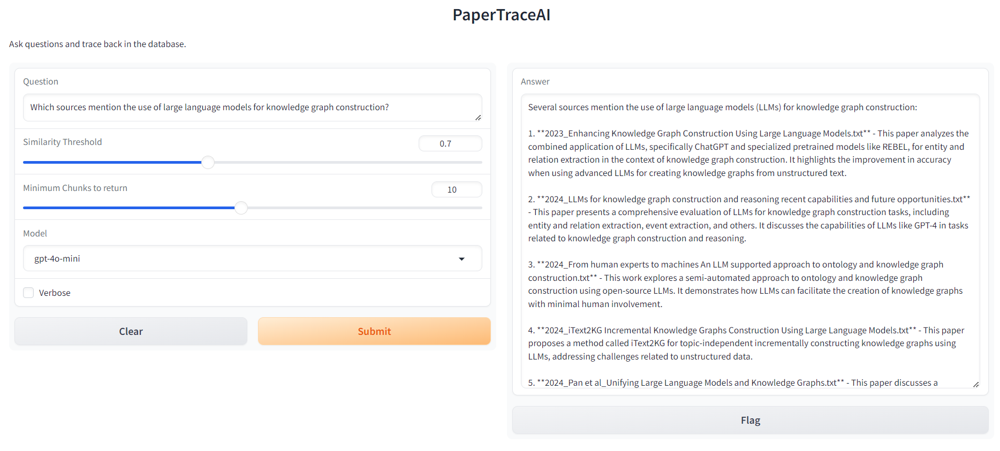

# PaperTraceAI

## Introduction

Have you ever found yourself drowning in a sea of research papers, struggling to remember where you read that crucial piece of information? Well, I have... many times... Therefore I created a simple tool, PaperTraceAI, that helps me quickly find information from the papers that I have read. Empowered with LLMs and RAG, PaperTraceAI acts like a personal research assistant, answering my questions and pointing me right back to the source. No more frantic searching through stacks of papers or endless scrolling through PDFs!



**Key Concepts**:
1. PDF to Text Conversion: transform PDF files into text format, storing them in the `papers_text` folder for easier processing.
2. Embedding Generation: create embeddings for chunks of the papers, saving them in the `vectorstore` folder for efficient retrieval.
3. RAG Implementation: utilize Retrieval-Augmented Generation (RAG) to fetch relevant text chunks, enabling the Language Model to provide responses with source attribution.


## Setup

Follow these steps to set up and run PaperTraceAI:

1. **Install dependencies**<br>
   ```
   pip install -r requirements.txt
   ```

2. **Set up language models**<br>
   - For Ollama:
     - Install Ollama from [https://ollama.ai/](https://ollama.ai/)
     - Pull the required model:
       ```
       ollama pull llama3.1
       ```
   - For OpenAI:
     - Set up your OpenAI API key as an environment variable:
       ```
       export OPENAI_API_KEY='your-api-key-here'
       ```

3. **Prepare your document database**<br>
   Run the `sync_papers.py` script to process and index your research papers:
   ```
   python sync_papers.py  --rewrite
   ```
   Parameters:
   - rewrite_emb: whether to rewrite the whole vector database or only process the new added files (and append to existing vector database)

   Note:
   - modify your pdf folder path and desired txt file saving path in `sync_papers.py` line 120-122.
   - default embedding model is `Alibaba-NLP/gte-large-en-v1.5`, you can change it in file `sync_embedding.py` line 9-10 and `rag.py` line 12. 

4. **Launch the PaperTraceAI interface**<br>
   Start the Gradio interface by running:
   ```
   python rag.py
   ```
   Parameters:
   - similarity threshold: return all the chunks the exceed this threshold
   - minimum chunks to return (k): if chunks exceeding threshold is less than k, then will return top k chunks
   - model: the LLM for chat, supports llama and gpt series (gpt-4o-mini is much better than llama3.1...)
   - verbose: whether to print the returned chunks in the response box


5. **Access the web interface**<br>
   Open your web browser and navigate to the URL provided in the console output (typically `http://127.0.0.1:7860`).

Now you can start asking questions about your research papers and trace back to the sources!